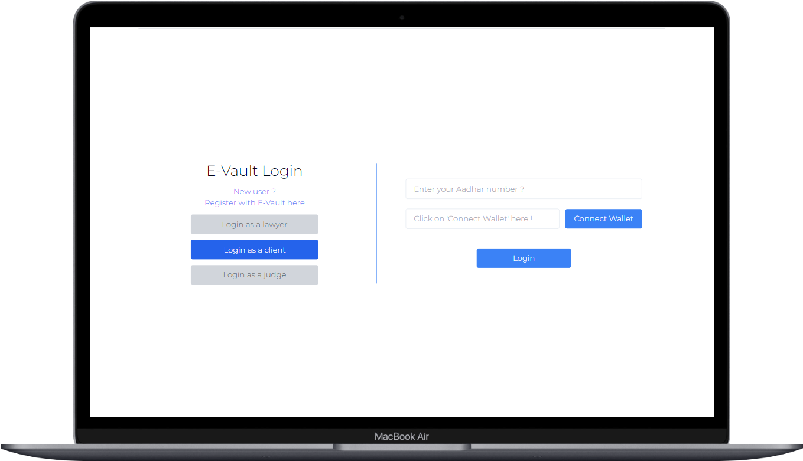
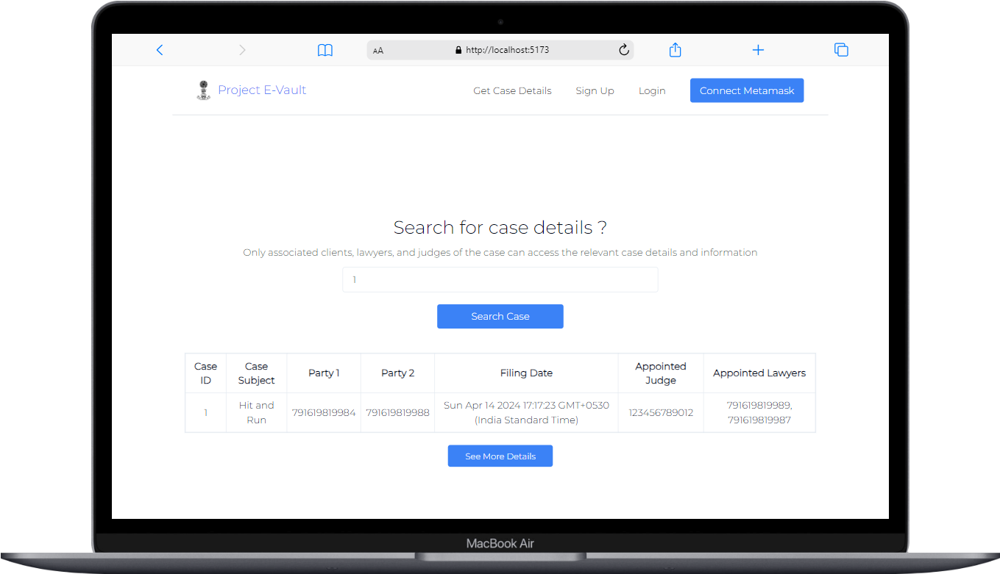
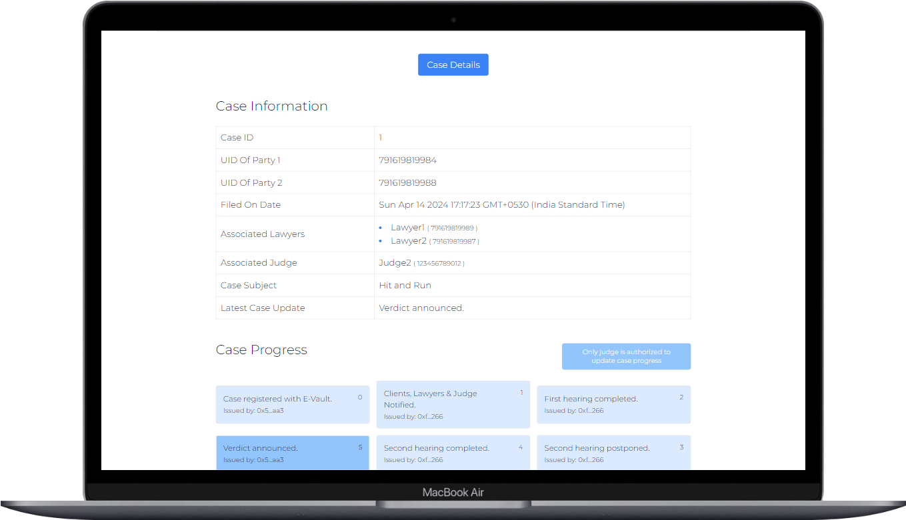

<h2>Project E-Vault (EVM Based)</h2>

<h4><b>A modernized blockchain(EVM) based eVault storage solution for the Indian Judiciary made using ViteJS and powered by IPFS.</b></h4>

<h3><b>Snapshots from the project :</b></h3>

Currently, the app can be tested on <b>Localhost (Hardhat)</b>, <b>Sepolia (EVM)</b>& <b>Polygin Amoy</b> test network using Alchemy endpoints.

<h3><b>E-Vault Features :</b></h3>

<ul>
    <li>Registering new clients, lawyers, judges on Evault</li>
    <li>Registering legal case betwwen 2 clients with their respectice clients</li>
    <li>Automatic / Random allocation of judges to registered cases</li>
    <li>Login system for clients, lawyers & judges using Aadhar UID</li>
    <li>Updating case progress by allocated judges & lawyers</li>
    <li>Uploading case documents to IPFS & keeping case records by associated case lawyers</li>
    <li>Fetching basic case information using caseIDs by general public and police</li>
    <li>Metamask wallet integration and usage for access authorization</li>
</ul>

<h3><b>Tech Stack :</b></h3>

<b>Frontend :</b>

<ul>
    <li>Vite JS</li>
    <li>Tailwind CSS</li>
    <li>React Toastify</li>
    <li>React Charts</li>
    <li>Shadcn UI</li>
</ul>

<b>Backend :</b>

<ul>
    <li>Node JS</li>
    <li>Hardhat Toolkit</li>
    <li>Metamask Wallet</li>
    <li>Ethers JS</li>
    <li>Alchemy</li>
    <li><a href="https://www.pinata.cloud/">Pinata IPFS</a></li>
</ul>

<b>Deployed Chains :</b>

<ul>
    <li>Ethereum Sepolia Testnet</li>
    <li>Polygon Amoy Testnet</li>
    <li>Hardhat Local Testnet ✅</li>
    <li>Morph Testnet ✅ </li>
</ul>

<h3><b>Guide for testing on local hardhat network :</b></h3>

<b>Environment variables :</b>

<ul>
    <li>Create a new .env file inside [blockchain-hardhat] folder taking reference from .env.example file inside the same.</li>
</ul>

<b>Backend :</b>

Terminal 1:

<ul>
    <li>Run (Move inside [blockchain-hardhat] folder): <b>cd blockchain-hardhat</b></li>
    <li>[ONLY ONCE] Run (Package installations): <b>npm install</b></li>
    <li>Run (Running Hardhat node locally): <b>npx hardhat node</b></li>
</ul>

Terminal 2:

<ul>
    <li>Run (Move inside [blockchain-hardhat] folder): <b>cd blockchain-hardhat</b></li>
    <li>[OPTIONAL] Run (Running tests): <b>npx hardhat test</b></li>
    <li>Run (Running deployment script for <b>Localhost</b>): <b>npx hardhat run scripts/deploy_fetchCaseDetailsByAClient.js --network localhost</b></li>
    <li>[OPTIONAL -> ONLY FOR SEPOLIA] Run (Running deployment script for <b>Sepolia</b>): <b>npx hardhat run scripts/deploy_fetchCaseDetailsByAClient.js --network sepolia</b></li>
</ul>

Update the <b>[backend-config.json]</b> file inside /frontend-vite with the updated contract-address under <b>"31337"</b> "address" feild fetched from Terminal 2.

[OPTIONAL -> ONLY FOR SEPOLIA] Update the <b>[backend-config.json]</b> file inside /frontend-vite with the updated contract-address under <b>"11155111"</b> "address" feild fetched from Terminal 2.

<b>Frontend :</b>

Terminal 1:

<ul>
    <li>Run (Move inside [frontend-vite] folder): <b>cd frontend-vite</b></li>
    <li>[ONLY ONCE] Run (Package installations): <b>npm install</b></li>
    <li>Run (Running frontend on localhost:5173): <b>npm run dev</b></li>
</ul>

<h3><b>Working:</b></h3>

https://www.loom.com/share/a5b5990273df4629b7dc2af6bbf9d08d?sid=3962bd00-ebff-4a92-9811-d50956a3c7e8

<b>The project is complete but I'm open to suggestions & modifications for this project. Please don't forget to put a ⭐ if you're feeling generous 😊</b>
